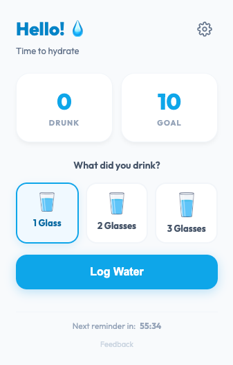
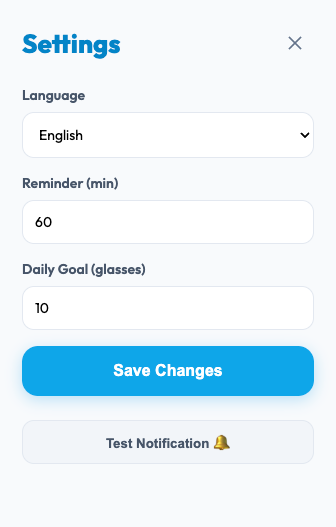

# Water Tracker Extension 💧

A Chrome/Brave extension designed to help you stay hydrated through timely reminders and a simple water intake logging system.

## Screenshots

### Main Dashboard

*The main view allows you to quickly log your water intake. You can choose between one, two, or three glasses and see your daily progress at a glance. It also features a real-time countdown to your next reminder.*

### Settings

*In the settings panel, you can customize your experience by switching languages (English/Spanish), adjusting the reminder frequency, and setting your daily hydration goal. There is also a "Test Notification" button to verify the visual alerts.*

## 🚀 Features
- **In-Page Visual Notifications**: A beautiful "Glassmorphism" toast appears directly on your current website, so you never miss a reminder.
- **Automatic Reminders**: Configurable notifications from 1 to 1440 minutes.
- **Quick Quantity Selector**: Log 1, 2, or 3 glasses of water at once with custom assets.
- **Automatic Daily Reset**: The counter resets to 0 at the start of each day.
- **Settings Dashboard**: Customize your daily goal and reminder frequency.
- **Multi-language Support**: Switch between English and Spanish seamlessly.
- **"Glassmorphism" Interface**: Modern, clean, and minimalist design.
- **Total Privacy**: All data is stored locally within your browser.

## 🛠️ Application Logic

### Storage
The extension uses `chrome.storage.local` to persist data. The saved fields are:
- `waterCount`: Number of glasses consumed today.
- `waterGoal`: Daily goal (default set to 8 glasses).
- `reminderInterval`: Notification frequency in minutes.
- `language`: User's preferred language (en/es).
- `lastResetDate`: The date of the last logged consumption, used for the daily reset check.

### Daily Reset
Every time the popup is opened:
1. It compares the current date with `lastResetDate`.
2. If they differ (meaning it's past midnight), it resets `waterCount` to `0` and updates `lastResetDate` to today's date.

### Alarm System
- **Background Service Worker**: Manages the timing and triggers notifications in the background.
- **Dynamic Rescheduling**: When the reminder interval is updated in settings, the background service worker automatically clears and recreates the alarm with the new timing.

## 📖 Installation Instructions
1. Open your browser (Chrome or Brave) and navigate to `chrome://extensions/`.
2. Enable **Developer mode** in the top right corner.
3. Click the **Load unpacked** button.
4. Select the `Water-Tracker-Extension` folder.

## 📂 Project Structure
- `manifest.json`: Main extension configuration.
- `background.js`: Background logic, multi-language notifications, and alarm management.
- `translations.js`: Dictionary containing all text strings for I18N.
- `popup.html`: Extension visual interface with main and settings views.
- `popup.js`: UI logic, view switching, and settings management.
- `style.css`: Visual styling with a modern glassmorphism aesthetic.
- `icons/`: Visual assets (`glass.png` for icon/selector, `drinking.png` for success screen).

## 💬 Feedback
We'd love to hear from you! Please share your thoughts or report issues in our [GitHub Discussions](https://github.com/joakimvivas/Water-Tracker-Extension/discussions).
